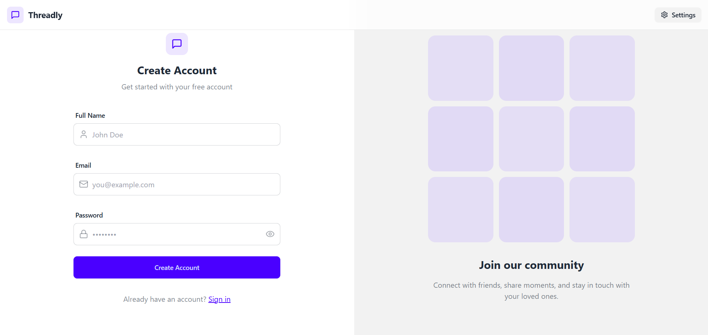

# ✨ Full Stack Realtime Chat App ✨




Highlights:

- 🌟 Tech stack: MERN + Socket.io + TailwindCSS + Daisy UI
- 🎃 Authentication && Authorization with JWT
- 👾 Real-time messaging with Socket.io
- 🚀 Online user status
- 👌 Global state management with Zustand
- 🐞 Error handling both on the server and on the client
- ⭐ At the end Deployment like a pro for FREE!
- ⏳ And much more!

### Setup .env file

```js
MONGODB_URI=...
PORT=5001
JWT_SECRET=...

CLOUDINARY_CLOUD_NAME=...
CLOUDINARY_API_KEY=...
CLOUDINARY_API_SECRET=...

NODE_ENV=development
```

### Build the app

```shell
npm run build
```

### Start the app

```shell
npm start
```
